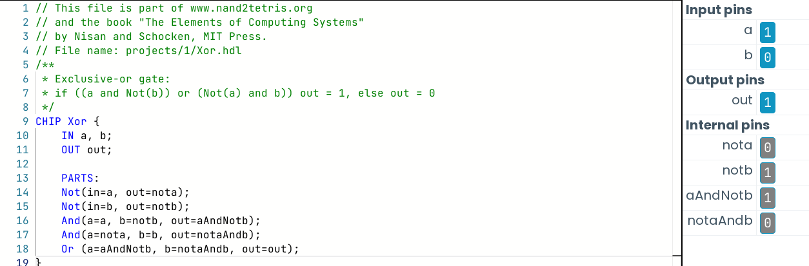

Si tenemos un archivo HDL, y queremos probarlo, podemos hacerlo a través de un software que simule el hardware, como por ejemplo:

https://nand2tetris.github.io/web-ide/chip/ <- Es el que se utiliza en el curso.

Este programa está diseñado específicamente para simular y probar archivos DHL.

### Simulación Interactiva

- Ejemplo de Xor.hdl
```
CHIP Xor {
	IN a, b;
	OUT out;

	PARTS:
	Not(in=a, out=nota);
	Not(in=b, out=notb);
	And(a=a, b=notb, out=aAndNotb);
	And(a=nota, b=b, out=notaAndb);
	Or (a=aAndNotb, b=notaAndb, out=out);
}
```
Esto es un ejemplo de archivo HDL que describe el funcionamiento de Xor en leguaje de descripción de hardware.

Para simular y probar nuestra descripción, debemos cargar el archivo hdl en el simulador de hardware; luego procederemos a introducir los inputs para verificar la salida.



Como podemos ver en la imagen, podemos jugar con los 'input pins', y nos calculará el output a partir de nuestra descripción. También podemos ver que nos da los resultados de los pines internos del circuito.

### Script-based Simulation

Para probar nuestros archivos dhl, debemos ir probando con diferentes inputs. Si tenemos un chip básico, no es problema, pero en caso de necesitar más opciones de inputs podemos utilizar 'test scripts'.
Ej Xor.tst:
```
load Xor.hdl
set a 0, set b 0, eval;
set a 0, set b 1, eval;
set a 1, set b 0, eval;
set a 1, set b 1, eval;
```
Este script se encargará de probar todos los inputs que le indiquemos de manera automática.
Tambíen podemos especificar que nos lance un output con una 'tabla de la verdad':
```
load Xor.hdl
output-file Xor.out
output-list a b out;
set a 0, set b 0, eval, output;
set a 0, set b 1, eval, output;
set a 1, set b 0, eval, output;
set a 1, set b 1, eval, output;
```
Xor.out:

| a   | b   | out |
| --- | --- | --- |
| 0   | 0   | 0   |
| 0   | 1   | 1   |
| 1   | 0   | 1   |
| 1   | 1   | 0   |
