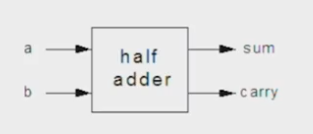
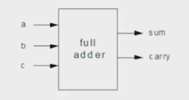

El objetivo de representar algo es si queremos manipularlo. pero ¿Qué tipo de manipulaciones podemos hacer con números binarios? 
- Suma
- Resta
- Comparación
- Multiplicación
- División

Una vez entendemos los números negativos podremos sumar "gratis", es decir, sumar por un número negativo. La multiplicación y división podemos hacerla a nivel de software en lugar de hacerla a través de circuitería.

#### Suma Binaria
Si tenemos [0001 0101 + 0101 1100] podemos convertirlo a decimal y luego sumarlo y convertir el resultado de nuevo a binario. Pero esto no es lo que hace un ordenador. 

0 0 0 1 0 1 0 1
0 1 0 1  1 1 0 1
___________
0 1 1 1 0 0 1 0

Literalmente se suma normal, si 1 + 1 = 0 y me llevo 1 para el siguiente.

Ej 2:
0  1   1  1  1  1   0  1
0  0  1  1  0  1  1  0
______________
1  0  1  1  0  0  1  1

Hay que tener cuidado con la suma porque puede provocar un overflow:

1001 0101 + 1101 1100 -> 0001 0111 0001, si queremos evitar el overfllow, nos olvidaríamos del 0001 que sobra.

#### Construyendo un Adder

- Half Adder - Añade 2 bits
- Full Adder - Añade 3 bits
- Adder - Añade 2 números

Si sumamos 2 bits, 1 + 1, esto resultará en 0 y producirá un 'acarreo' de 1.

Half Adder:

| A   | B   | SUM | CARRY |
| --- | --- | --- | ----- |
| 0   | 0   | 0   | 0     |
| 1   | 0   | 1   | 0     |
| 0   | 1   | 1   | 0     |
| 1   | 1   | 0   | 1     |

Full Adder:

| A   | B   | C   | SUM | CARRY |
| --- | --- | --- | --- | ----- |
| 0   | 0   | 0   | 0   | 0     |
| 1   | 0   | 1   | 1   | 0     |
| 0   | 1   | 0   | 1   | 0     |
| 0   | 1   | 1   | 0   | 1     |
| 1   | 0   | 0   | 1   | 0     |
| 1   | 0   | 1   | 0   | 1     |
| 1   | 1   | 0   | 0   | 1     |
| 1   | 1   | 1   | 1   | 1     |

